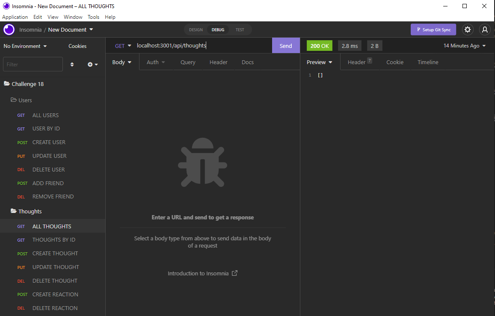

# Social Network API

This is an actual back-end program that works similarly like a social media website. You can add and remove friends as well as add and update users. These actions are collectively referred to as adding and removing users. Each user is capable of having various thoughts, and each thought is also capable of having multiple responses to it.

## Installation/Usage

1. Download/clone my repository
2. This app requires `node.js` to be used.
3. Do `npm install` to install the required npm dependecies
4. You must also have `insomnia` to use the api end points 
5. Then `npm start` to run locally on your machine

## Showcase

Video Example: https://drive.google.com/file/d/1C_A7auo_LPrOHRBtEn6BRTuXM0Ly6x9Z/view

All Routes:

## Features

* JavaScript
* Node
* Express
* MongoDB
* Mongoose
* NPM

## License

Copyright &copy; Tye Stanley. All rights reserved.
  
  Licensed under the [MIT](LICENSE) license.